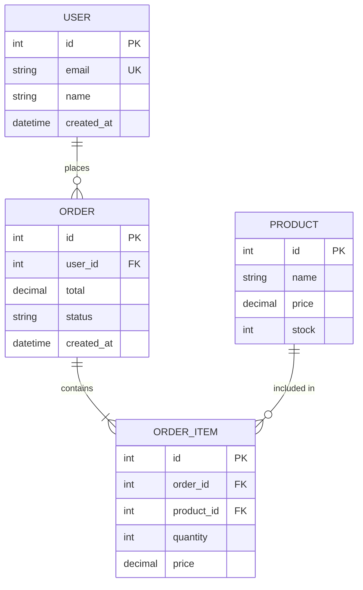
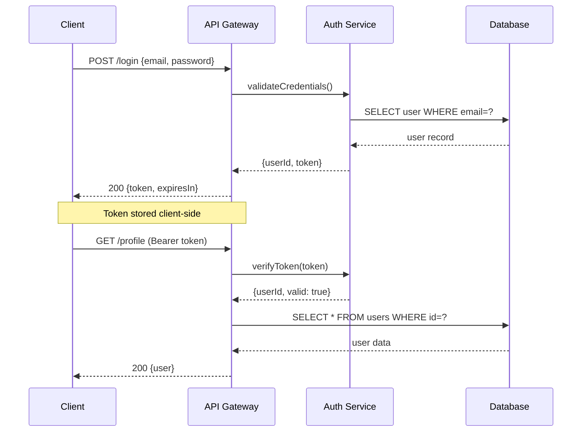
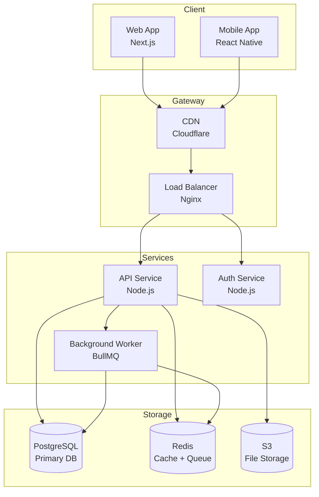
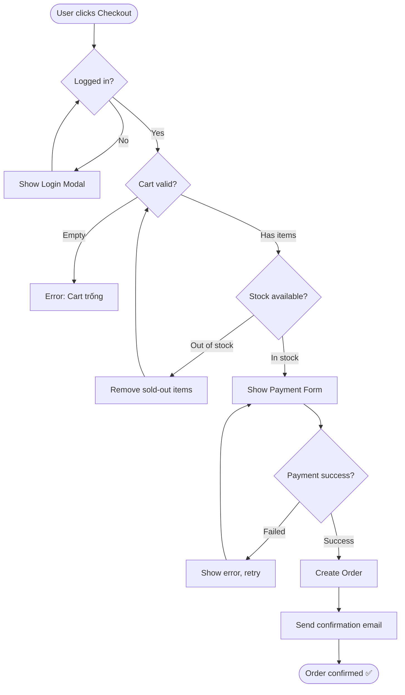
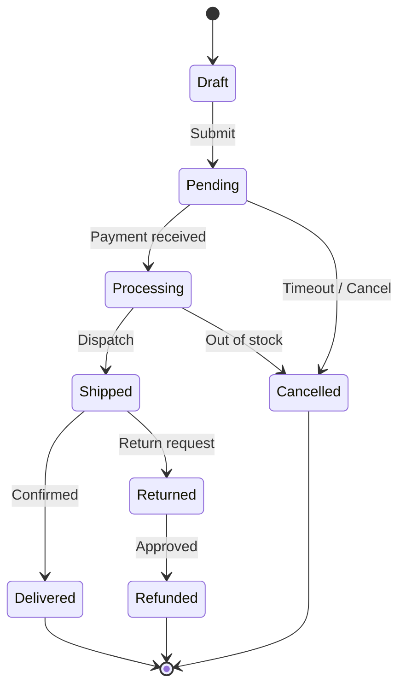

# AWF Diagramming — Biến Mô Tả Thành Sơ Đồ

## Tổng quan
Một diagram tốt truyền đạt kiến trúc trong 5 giây mà 500 từ mô tả không làm được.
Skill này tự động chọn đúng loại diagram cho đúng tình huống và output Mermaid code có thể render ngay.

> 💡 **Nguyên tắc:** Diagram là artifact, không phải decoration. Mỗi diagram phải trả lời đúng 1 câu hỏi cụ thể.

---

## Khi nào kích hoạt

✅ **Tự động kích hoạt khi:**
- User dùng `/design` → vẽ Architecture + ER diagram
- User dùng `/plan` → vẽ Flowchart cho user journey
- User dùng `/review` → vẽ Dependency graph nếu phát hiện coupling
- User nói: "vẽ sơ đồ", "diagram", "flowchart", "draw me", "visualize"

---

## Bảng chọn Diagram type

| Câu hỏi cần trả lời | Loại diagram | Khi nào dùng |
|---------------------|-------------|-------------|
| Dữ liệu trông như thế nào? | **ER Diagram** | Database design, data modeling |
| Code gọi nhau như thế nào? | **Sequence Diagram** | API flows, authentication, messaging |
| Logic chạy theo hướng nào? | **Flowchart** | Business logic, decision trees, user journey |
| System gồm những gì? | **Architecture Diagram** | Infra, microservices, deployment |
| Class quan hệ với nhau thế nào? | **Class Diagram** | OOP design, domain modeling |
| Process theo thứ tự ra sao? | **Gantt / Timeline** | Project planning, release schedule |
| State machine? | **State Diagram** | UI states, order lifecycle |

---

## Templates sẵn dùng

### 🗄️ ER Diagram (Database Schema)



### 🔄 Sequence Diagram (API Flow)



### 🏗️ Architecture Diagram (System Overview)



### 📊 Flowchart (Business Logic)



### 🔵 State Diagram (Lifecycle)



---

## Quy trình tạo Diagram

### Bước 1: Phân tích yêu cầu
```
User nói → Xác định:
  - Câu hỏi cần trả lời là gì?
  - Audience là ai? (Engineer? Business? Designer?)
  - Context đang ở phase nào? (Design? Review? Debug?)
```

### Bước 2: Chọn đúng loại (xem bảng trên)

### Bước 3: Draft nhanh
- Start simple — 5-7 nodes để validate structure trước
- Không cần perfect ngay lần đầu
- Hỏi user "Đây đúng flow chưa?" trước khi detail hơn

### Bước 4: Render + Export
Output theo format:
```markdown
## [Tên Diagram]

> [Mô tả 1 câu: diagram này trả lời câu hỏi gì]

```mermaid
[code]
```

**Đọc diagram này:**
- [Hướng dẫn đọc ngắn gọn nếu phức tạp]
- [Key relationships hoặc decision points]
```

---

## Tích hợp với AWF Workflows

### → `/design` (Auto-trigger)
Khi user kết thúc `/design`, tự động gợi ý:
```
"Anh muốn em vẽ thêm không?
1️⃣ ER Diagram cho database schema vừa design
2️⃣ Sequence Diagram cho API flow chính
3️⃣ Architecture Diagram overview toàn hệ thống"
```

### → `/plan` (Auto-trigger)
Khi plan xong, offer:
```
"Em vẽ User Journey Flowchart cho feature này nhé? (type: y/n)"
```

### → `/review` (Conditional)
Nếu phát hiện coupling phức tạp trong code review:
```
"Em thấy module dependencies khá rối. Anh muốn em vẽ Dependency Graph không?"
```

---

## Best Practices

**✅ Diagram tốt:**
- Có title rõ ràng
- Trả lời đúng 1 câu hỏi
- Không quá 15 nodes (quá nhiều = cần split)
- Có legend nếu dùng nhiều ký hiệu

**❌ Diagram xấu:**
- "God diagram" — cố nhét mọi thứ vào 1 diagram
- Nodes tên quá tắt không ai hiểu
- Không có direction rõ ràng (vẽ thế nào cũng được)
- Copy-paste từ tool không có context

---

## 🚩 Red Flags

- User hỏi về architecture nhưng không có diagram → thiếu shared understanding
- Diagram quá phức tạp (>20 nodes) → cần split thành nhiều views
- Diagram mô tả "current state" mà không có "desired state" → không actionable
- Vẽ diagram sau khi code (should be before)
